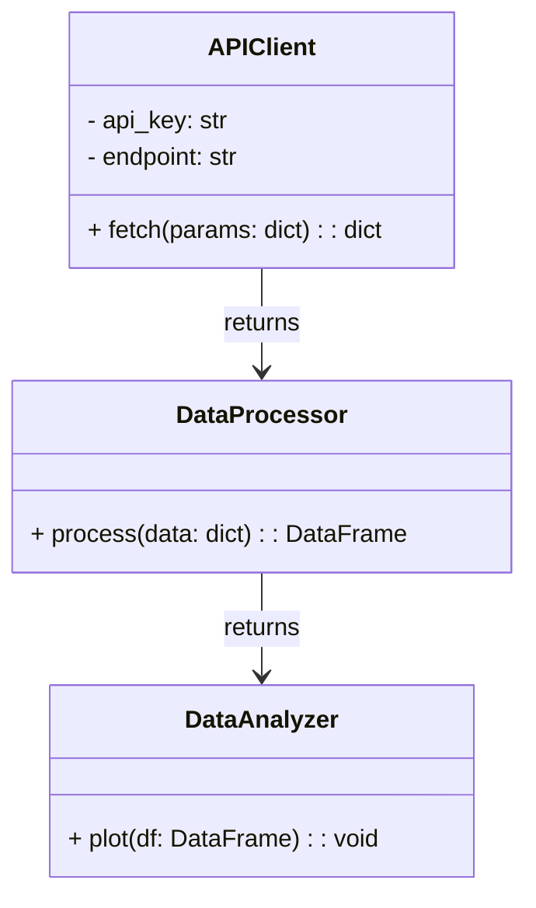

```mermaid
classDiagram
    class APIClient {
        - api_key: str
        - endpoint: str
        + fetch(params: dict): dict
    }

    class DataProcessor {
        + process(data: dict): DataFrame
    }

    class DataAnalyzer {
        + plot(df: DataFrame): void
    }

    APIClient --> DataProcessor : returns
    DataProcessor --> DataAnalyzer : returns
```